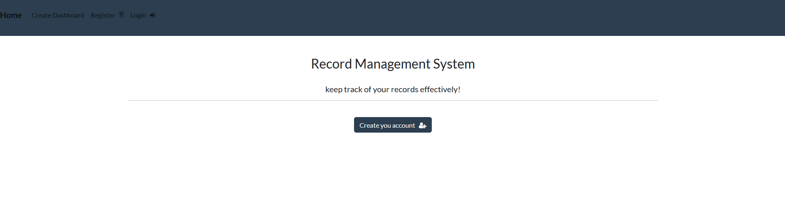
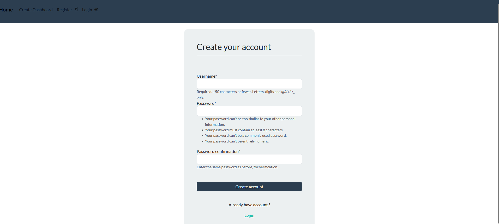
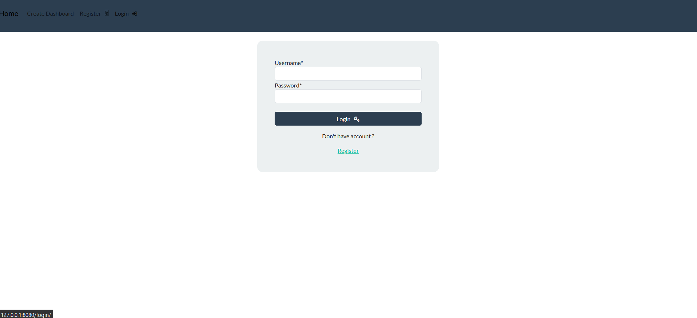
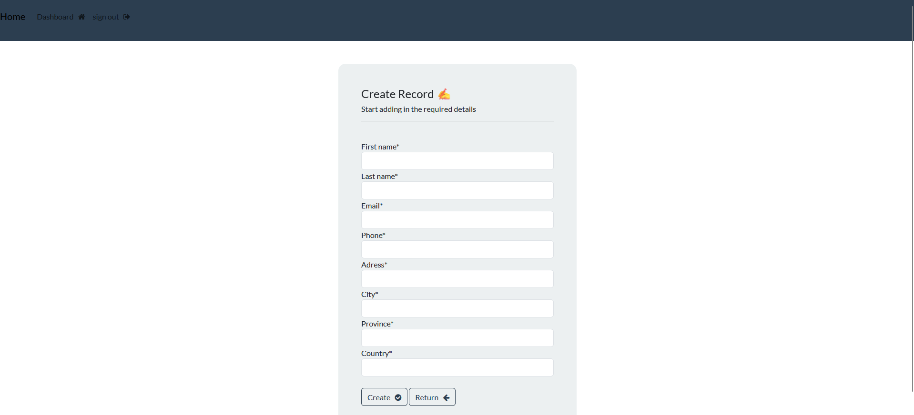
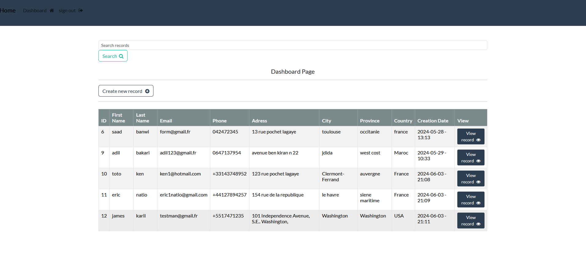

# Django UserAuth and Record Management

A comprehensive Django-based web application that includes user authentication (registration, login, logout) and CRUD operations for managing records.

## Features

- User Registration
- User Login and Logout
- Create, Read, Update, Delete (CRUD) operations for Records
- Search functionality for Records

## Requirements

- Python 3
- Django
- javascript
- pillow
- django-crispy-forms
- Bootstrap
  
  
## Create and activate a virtual environment
```bash
python -m venv venv
source venv/bin/activate   # On Windows use `venv\Scripts\activate`
```
## Install the required packages
```bash
pip install -r requirements.txt
```

## Installation

1. Clone the repository:

```sh
git clone https://github.com/biossama/Django.git
cd Django/CRUD-recordKeeper
````











