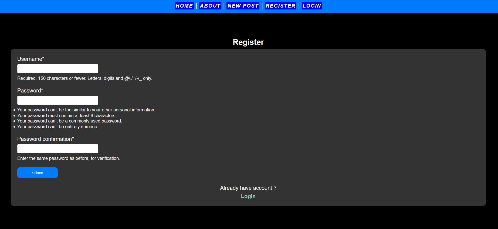
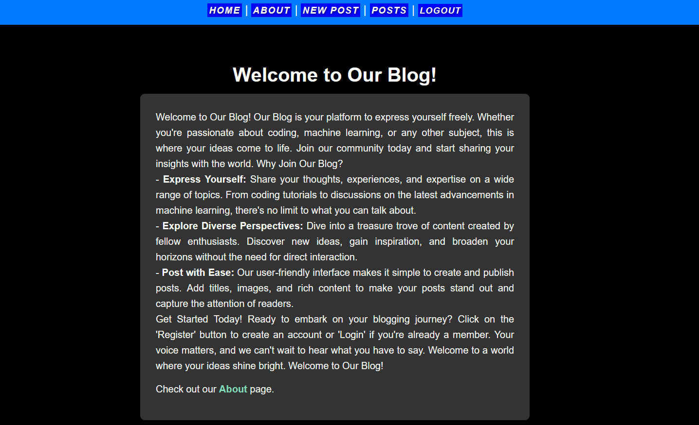
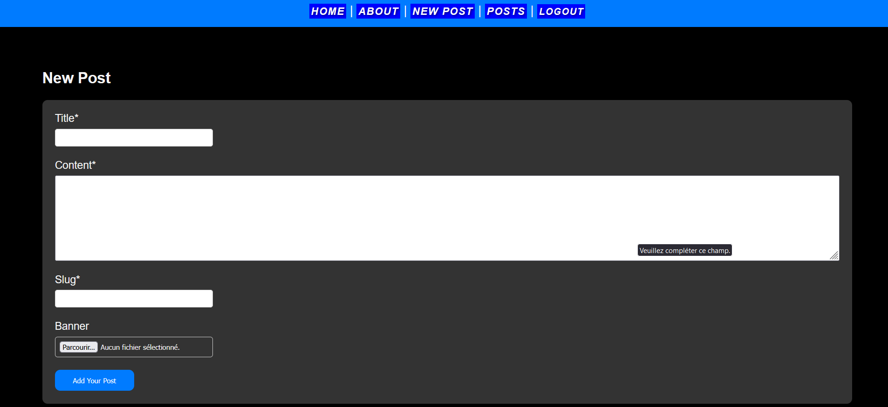
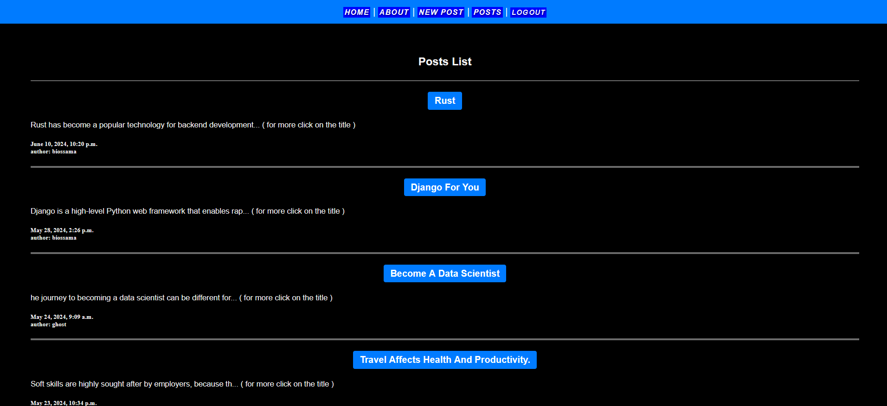
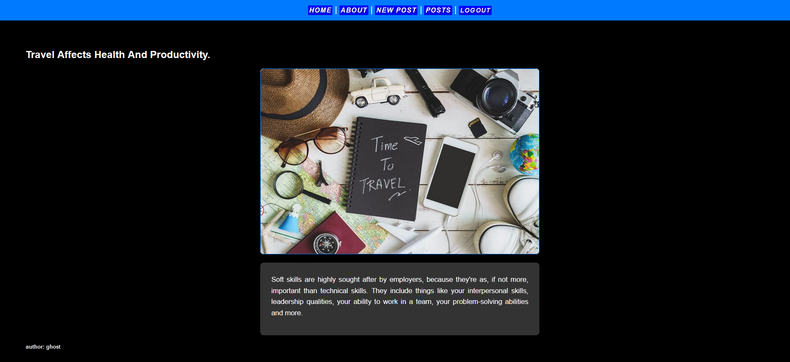

# My Web Application

This is a web application built with Django that allows users to register, log in, log out, and manage posts. The application includes features such as user authentication, post creation, and viewing posts.

## Features

- User Registration
- User Login
- User Logout
- Create New Posts (restricted to logged-in users)
- View All Posts
- View Single Post Details

## Requirements

- Python 3
- Django 3 or higher
- Any other dependencies specified in `requirements.txt`

## Installation

1. Clone the repository:
    ```sh
    git clone https://github.com/yourusername/Django.git
    cd website-post
    ```

2. Create a virtual environment:
    ```sh
    python -m venv .venv
    source .venv/bin/activate  
    ```

3. Install the dependencies:
    ```sh
    pip install -r requirements.txt
    ```

4. Apply the migrations:
    ```sh
    python manage.py migrate
    ```

5. Create a superuser for accessing the admin site:
    ```sh
    python manage.py createsuperuser
    ```

6. Run the development server:
    ```sh
    python manage.py runserver 8080
    ```

7. Open your web browser and navigate to `http://127.0.0.1:8080/` to see the application.

## Usage

### User Registration

- Go to `/users/register/` to create a new account.

### User Login

- Go to `/users/login/` to log in.

### User Logout

- Go to `/users/logout/` to log out.

### Viewing Posts

- Visit the home page `/` to see all posts.
- Click on a post title to view the post details.

### Creating New Posts

- You must be logged in to create a new post.
- Go to `/posts/new/` to create a new post.

## Project Structure

- `users/` - Contains views, models, and templates for user authentication.
- `posts/` - Contains views, models, and templates for managing posts.
- `templates/` - Contains HTML templates for the application.
- `static/` - Contains static files (CSS, JavaScript, images).















